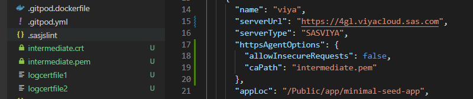

# sasjs auth

The `sasjs auth` command authenticates against a predefined SAS _target_.  The following commands make use of authentication:

* sasjs run
* sasjs job execute
* sasjs flow
* sasjs request
* sasjs deploy
* sasjs test
* sasjs folder

The `sasjs auth` command is an alias for `sasjs add cred` - and it is integrated also into the `sasjs add` command (for adding a new target).

## Prerequisites

Before using this command, you will need to:

- [install](/installation) the SASjs CLI
- [add](/add) a deployment target.

## Syntax

```
sasjs auth [additional arguments]
```

Additional arguments may include:

- `--target` (alias `-t`) - the target environment in which to deploy the services. If not specified, the `defaultTarget` will be used, as defined in `sasjsconfig.json`. The target can exist either in the local project configuration or in the global `.sasjsrc` file.


## Scope

Targets can have *local* (to a project) or *global* (to a user) [scope](/faq/#what-is-the-difference-between-local-and-global-targets).  For a local target, credentials are stored in a `.env.[target name]` file.  To have one file that covers all (local) targets you can rename this file to `.env`.

All published SASjs projects (and templates) already include this file in the `.gitignore` file, if you are deploying to your own existing project you should do the same - to prevent accidentally pushing credentials to source control.

For global targets the credentials are stored in the `.sasjsrc` file in the users home directory.

## Server Type

The authentication approach taken will depend on the [serverType](/sasjsconfig.html#targets_items_anyOf_i0_serverType) (SASVIYA, SAS9 or SASJS).

### SAS Viya Authentication
To authenticate with SAS Viya you will need an administrator to provide a CLIENT and SECRET with `authorization_code` grant type (SASjs does not support password authentication grant type).  Further information on this topic is available [here](/faq/#how-can-i-obtain-a-viya-client-and-secret).

After you provide the client / secret, you are given a link which you must click to obtain the authorisation code.  Be sure to select any scopes (such as openid) if presented.

Once you provide the authorisation code, the ACESS_TOKEN and REFRESH_TOKEN are saved and used for further connection requests.  If the ACCESS_TOKEN expires (by default after 12 hours) the REFRESH_TOKEN will be used automatically to update, until it also expires (by default after 30 days).  At this point, you will need to run `sasjs auth` once again.

### SAS 9 Authentication
SAS 9 authentication requires a username and password.  We strongly recommend the use of SAS encoded passwords (method=sas003 and above), however - to enable this you will first need to make a server side change (to the `AllowEncodedPassword` property) as follows:

1. Log on to SAS® Management Console.
2. Select Application Management.
3. Navigate to Configuration Manager ► Stored Process Web App
4. Select Properties ► Advanced (tab).
5. Click the Add button and define a new property:
    * Property Name: AllowEncodedPassword
    * Property Value: true
6. Click OK
7. Restart the Mid Tier Web Server

If the password you provide is not sas-encoded, the command will still work, however you will get health warnings in the log.

#### SASjs Runner

SAS 9 operations require the use of a "runner" for executing the SAS code generated by the CLI.  For security, this runner is always stored in your home directory in metadata.

To deploy the runner:

```sas
/* import the macros */
filename mc url "https://raw.githubusercontent.com/sasjs/core/main/all.sas";
%inc mc;
/* create the runner */
filename ft15f001 temp;
parmcards4;
%macro sasjs_runner();
%if %symexist(_webin_fileref) %then %do;
%inc &_webin_fileref;
%end;
%mend sasjs_runner;
%sasjs_runner()
;;;;
%mm_createwebservice(
  path=/User Folders/&sysuserid/My Folder/sasjs,
  name=runner
)
```

### SASJS Server Authentication

Authentication on SASjs Server is only neccessary in [server mode](https://server.sasjs.io/settings/#mode) (there is no authentication in desktop mode).  The default clientID is `clientID1`.


## TLS Config

If the server certificates are set up correctly (full chain) then no additional config is required.  However, sometimes when there are self-signed certificates, the following error may occur:

> unable to verify the first certificate

It means that the webserver you are connecting to is misconfigured (certificate chain is incomplete) and did not include the intermediate certificate.

To resolve, you may step through the following.  Replace "4gl.viyacloud.sas.com" with your own SAS server URL.

```bash
# 1. grap the logcertfile
openssl s_client -connect 4gl.viyacloud.sas.com:443 -servername 4gl.viyacloud.sas.com | tee logcertfile
# 2. obtain the issuer URI
openssl x509 -in logcertfile -noout -text | grep -i "issuer"
# 3. Fetch CRT from URI above
# for this case, using "http://cacerts.digicert.com/DigiCertTLSRSASHA2562020CA1-1.crt"
curl --output intermediate.crt http://cacerts.digicert.com/DigiCertTLSRSASHA2562020CA1-1.crt
# 4. extract intermediate.pem from the CRT file
openssl x509 -inform DER -in intermediate.crt -out intermediate.pem -text
```

If you don't have a well-formed URI in step 3 above, you might try step 4 directly on the CRT if you are able to find it.  One option is to look in the browser (click the padlock) or check the filesystem - here is a possible location on a Viya platform:  `/opt/sas/viya/config/etc/SASSecurityCertificateFramework/tls/certs`.

Further information on this topic is available in this StackOverflow thread: [https://stackoverflow.com/a/60020493](https://stackoverflow.com/a/60020493)

Once you have the PEM file it can be added to the [httpsAgentOptions configuration](https://cli.sasjs.io/sasjsconfig.html#httpsAgentOptions) as follows:



As a last resort, if you are running internally and you trust the target server, you may consider the following property in your `sasjs/sasjsconfig.json` file to temporariliy ignore the certificate errors.  However this is not generally recommended.

```json
      "httpsAgentOptions": {
        "allowInsecureRequests": true
      }
```