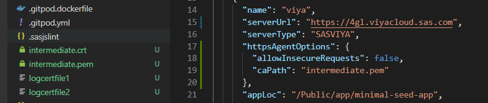

# sasjs auth

The `sasjs auth` command authenticates against a predefined SAS _target_.  The following commands make use of authentication:

* sasjs run
* sasjs job execute
* sasjs flow
* sasjs fs
* sasjs request
* sasjs deploy
* sasjs test
* sasjs folder

The `sasjs auth` command has two modes:

* `sasjs auth` (no subcommand) - an alias for `sasjs add cred` (client/secret + authorisation code flow).  It is integrated also into the `sasjs add` command (for adding a new target).
* `sasjs auth login` - authenticate with a regular **SAS username and password**, without needing a registered client/secret (Viya only).  See [below](#sasjs-auth-login).

## Prerequisites

Before using this command, you will need to:

- [install](/installation) the SASjs CLI
- [add](/add) a deployment target.

## Syntax

```
sasjs auth [additional arguments]
```

Additional arguments may include:

- `--target` (alias `-t`) - the target environment in which to deploy the services. If not specified, the `defaultTarget` will be used, as defined in `sasjsconfig.json`. The target can exist either in the local project configuration or in the global `.sasjsrc` file.


## Scope

Targets can have *local* (to a project) or *global* (to a user) [scope](/faq/#what-is-the-difference-between-local-and-global-targets).  For a local target, credentials are stored in a `.env.[target name]` file.  To have one file that covers all (local) targets you can rename this file to `.env`.

All published SASjs projects (and templates) already include this file in the `.gitignore` file, if you are deploying to your own existing project you should do the same - to prevent accidentally pushing credentials to source control.

For global targets the credentials are stored in the `.sasjsrc` file in the users home directory.

## Server Type

The authentication approach taken will depend on the [serverType](/sasjsconfig.html#targets_items_anyOf_i0_serverType) (SASVIYA, SAS9 or SASJS).

### SAS Viya Authentication

There are two ways to authenticate with SAS Viya:

1. **`sasjs auth login`** (recommended for developers) - sign in with your regular SAS username and password.  No client/secret is needed.  See [sasjs auth login](#sasjs-auth-login) below.
2. **`sasjs auth`** (client/secret) - an administrator provides a CLIENT and SECRET with the `authorization_code` grant type.  Further information on this topic is available [here](/faq/#how-can-i-obtain-a-viya-client-and-secret).  This remains the recommended approach for CI pipelines.

After you provide the client / secret, you are given a link which you must click to obtain the authorisation code.  Be sure to select any scopes (such as openid) if presented.

Once you provide the authorisation code, the ACESS_TOKEN and REFRESH_TOKEN are saved and used for further connection requests.  If the ACCESS_TOKEN expires (by default after 12 hours) the REFRESH_TOKEN will be used automatically to update, until it also expires (by default after 30 days).  At this point, you will need to run `sasjs auth` once again.

### sasjs auth login

!!! warning
    This flow uses the OAuth2 *resource owner password credentials* grant, which is deprecated in OAuth 2.1.  It is intended for dev/demo estates where obtaining a registered client/secret is impractical.  For CI pipelines and production use, use a properly registered client/secret (via `sasjs auth`).

The `sasjs auth login` command authenticates against a SAS Viya target using a regular SAS username and password - **no registered OAuth client/secret is required**.  It uses the password grant against the built-in, secret-less `sas.cli` public client (the same client used by the official SAS Viya CLI), and the resulting token carries full user impersonation.

```
sasjs auth login -t myviyatarget
```

Additional arguments may include:

- `--target` (alias `-t`) - the target environment to authenticate against.
- `--insecure` (alias `-i`) - bypass TLS certificate validation, for Viya servers with self-signed certificates (mirrors the `--insecure` flag on `sasjs add cred`).  For a permanent fix, prefer the [httpsAgentOptions](/sasjsconfig.html#httpsAgentOptions) configuration described in [TLS Config](#tls-config).

You will be prompted for your username and password (the password input is masked).  The password is **never stored** - it is exchanged directly for an ACCESS_TOKEN / REFRESH_TOKEN pair, which is verified (against `/identities/users/@currentUser`) and then persisted exactly as with the regular `sasjs auth` flow (`.env.[target name]` for local targets, `~/.sasjsrc` for global targets).

All authenticated commands (`sasjs run`, `sasjs deploy`, `sasjs job execute`, `sasjs flow`, `sasjs fs`, `sasjs request`, `sasjs context`, `sasjs folder`, `sasjs test`) then work exactly as before - no client/secret is ever needed.

Example:

```bash
sasjs auth login -t viya
# Username: viyademo01
# Password: ********
# Logged in as viyademo01 (Viya Demo User)

sasjs run myprogram.sas -t viya
```

#### Token expiry and refresh

The CLI automatically refreshes the access token using the stored refresh token (via the `sas.cli` client) whenever it is close to expiry - this works with or without a registered client/secret.  If the refresh token itself expires (or is rejected by the server), simply run `sasjs auth login -t <target>` again.

!!! note
    Some estates issue short-lived access tokens for the `sas.cli` client (e.g. 1 hour instead of the usual 12), which means a silent refresh happens on most invocations.  This is normal and harmless.  Note also that Viya refresh tokens are single-use and rotate on every refresh - the CLI persists the rotated pair automatically after every refresh, including refreshes that happen inside long-running job executions.

#### Requirements and limitations

* The password grant must be enabled for the `sas.cli` client (the default on Viya 3.5+ and Viya 4).
* The account must be a local or LDAP account - `sasjs auth login` **cannot** work on SSO/SAML/MFA-only estates.
* If the estate has self-signed certificates, use the `--insecure` flag or configure [httpsAgentOptions](/sasjsconfig.html#httpsAgentOptions) as described in [TLS Config](#tls-config) below.
* On a cold Viya estate, the first compute session creation can take several minutes (pod spin-up) - the first `sasjs run` may appear to hang.  Subsequent runs are fast.
* If `sasjs run` fails with a 403 when creating a compute session, your account may not be authorised for the configured compute context - try setting `contextName: "SAS Studio compute context"` on the target.

### SAS 9 Authentication
SAS 9 authentication requires a username and password.  We strongly recommend the use of SAS encoded passwords (method=sas003 and above), however - to enable this you will first need to make a server side change (to the `AllowEncodedPassword` property) as follows:

1. Log on to SAS® Management Console.
2. Select Application Management.
3. Navigate to Configuration Manager ► Stored Process Web App
4. Select Properties ► Advanced (tab).
5. Click the Add button and define a new property:
    * Property Name: AllowEncodedPassword
    * Property Value: true
6. Click OK
7. Restart the Mid Tier Web Server

If the password you provide is not sas-encoded, the command will still work, however you will get health warnings in the log.

#### SASjs Runner

SAS 9 operations require the use of a "runner" for executing the SAS code generated by the CLI.  For security, this runner is always stored in your home directory in metadata.

To deploy the runner:

```sas
/* import the macros */
filename mc url "https://raw.githubusercontent.com/sasjs/core/main/all.sas";
%inc mc;
/* create the runner */
filename ft15f001 temp;
parmcards4;
%macro sasjs_runner();
%if %symexist(_webin_fileref) %then %do;
%inc &_webin_fileref;
%end;
%mend sasjs_runner;
%sasjs_runner()
;;;;
%mm_createwebservice(
  path=/User Folders/&sysuserid/My Folder/sasjs,
  name=runner
)
```

### SASJS Server Authentication

Authentication on SASjs Server is only neccessary in [server mode](https://server.sasjs.io/settings/#mode) (there is no authentication in desktop mode).  The default clientID is `clientID1`.


## TLS Config

If the server certificates are set up correctly (full chain) then no additional config is required.  However, sometimes when there are self-signed certificates, the following error may occur:

> unable to verify the first certificate

It means that the webserver you are connecting to is misconfigured (certificate chain is incomplete) and did not include the intermediate certificate.

To resolve, you may step through the following.  Replace "4gl.viyacloud.sas.com" with your own SAS server URL.

```bash
# 1. grap the logcertfile
openssl s_client -connect 4gl.viyacloud.sas.com:443 -servername 4gl.viyacloud.sas.com | tee logcertfile
# 2. obtain the issuer URI
openssl x509 -in logcertfile -noout -text | grep -i "issuer"
# 3. Fetch CRT from URI above
# for this case, using "http://cacerts.digicert.com/DigiCertTLSRSASHA2562020CA1-1.crt"
curl --output intermediate.crt http://cacerts.digicert.com/DigiCertTLSRSASHA2562020CA1-1.crt
# 4. extract intermediate.pem from the CRT file
openssl x509 -inform DER -in intermediate.crt -out intermediate.pem -text
```

If you don't have a well-formed URI in step 3 above, you might try step 4 directly on the CRT if you are able to find it.  One option is to look in the browser (click the padlock) or check the filesystem - here is a possible location on a Viya platform:  `/opt/sas/viya/config/etc/SASSecurityCertificateFramework/tls/certs`.

Further information on this topic is available in this StackOverflow thread: [https://stackoverflow.com/a/60020493](https://stackoverflow.com/a/60020493)

Once you have the PEM file it can be added to the [httpsAgentOptions configuration](https://cli.sasjs.io/sasjsconfig.html#httpsAgentOptions) as follows:



For testing, if you are running internally and you trust the target server, you may consider the following property in your `sasjs/sasjsconfig.json` file to temporarily ignore the certificate errors.  However, this is not a recommended approach.

```json
      "httpsAgentOptions": {
        "allowInsecureRequests": true
      }
```
