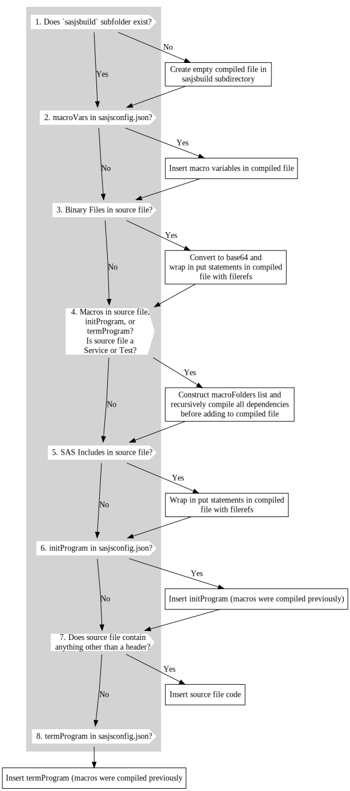

# sasjs compile

Compilation in SASjs is driven from the `sasjs/sasjsconfig.json` file, and results in the creation of a single self-contained SAS program per JOB / SERVICE / TEST.

The benefits of working with compiled files are severalfold:

* Elimination of SAS Catalogs for macros / programs
* Elimination of filesystem dependency for code
* Resilient and Highly Portable Applications
* Transparent / Easy to debug
* Simple to deploy

`sasjs compile` can be applied to a single file, or more commonly, to all the files in a project.

The following diagram illustrates the flow:



## Compile Project

From the root of the project, run: `sasjs compile`. This will cycle through all the Jobs / Services / Tests in the `jobFolders` / `serviceFolders` / `testFolders` arrays in the `sasjsconfig.json` file, extract all of the dependent Binary Files, SAS Macros, SAS Includes, and create one self-contained file per Job (or Service, or Test) inside the `sasjsbuild` folder. The self-contained file will also include any `initProgram`, `termProgram` and `macroVariables` defined in the relevant config objects.

The `binaryFolders`, `macroFolders` and `programFolders` arrays are searched for Binary Files, SAS Macros and SAS Includes (first in the target config, then in the root). If a _macro_ is not found, then then the [macro core](https://core.sasjs.io) library is also searched (either from the local project, the dependency of the local CLI install, or from the global CLI install). If the macro is still not found, then the compilation will fail.

The `serviceConfig`, `jobConfig` and `testConfig` objects may have attributes split at either or both target and root level in the `sasjsconfig.json` file.

The above items are added to the compiled Job/Service/Test in the following order:

1. MacroVars
2. Binary Files
3. Macros
4. Programs
5. initProgram
6. Job/Service/Test
7. termProgram

The following diagram illustrates (needs updating):


If `streamWeb` is `true`, then the `index.html` file in your `webSourcePath` is also scanned and any linked JS / CSS files are also compiled into the `streamWebFolder` folder. The `index.html` becomes a `clickme` service in your `appLoc` SAS folder root.

Finally, if the `syncFolder` attribute is set, then the contents will be simply copied into the `sasjsbuild` folder.  This is useful for providing mocked services (eg in [sasjs/server](https://github.com/sasjs/server)) or to add arbitrary content to the SAS logical folder tree.

### Syntax

```
sasjs compile [additional arguments]
```

Additional arguments include:

- `--target` (alias `-t`) - The target to use for obtaining the source folders of programs and macros. If it is not specified, default target will be used, mentioned in `sasjsconfig.json`. The target can exist either in the local project configuration or in the global `.sasjsrc` file. OPTIONAL

Examples:

```bash
sasjs compile
sasjs c
sasjs c -t someTarget
```

## Compile Single File

Instead of compiling an entire project, you can compile a single file.  It is necessary to state whether the file being compiled is a job, service or test (as these file types are compiled with differing pre-code).

### Syntax

```
sasjs compile <action> [additional arguments]
```

`action` can be `job` or `service` or `test`

Additional arguments include:

- `--source` (alias `-s`) - the path/name.ext of the individual source file to compile (as job or service). MANDATORY
- `--target` (alias `-t`) - The target to use for obtaining the source folders of programs and macros. If it is not specified, the default target will be used, mentioned in `sasjsconfig.json`. The target can exist either in the local project configuration or in the global `.sasjsrc` file. OPTIONAL
- `--output` (alias `-o`) - path where output of the compiled job or service will be saved. OPTIONAL. If not provided, the output will go to the root of the `sasjsbuild` folder if in a project (`sasjsbuild` would be emptied first), else in the current working directory.

```bash
sasjs compile job -s sasjs/jobs/admin/somejob -o compiledjobs/folder
sasjs c service --source sasjs/services/common/appinit -t myTarget
```

## Tests compilation

As part of compilation process test files will be compiled as well. Test configuration should be provided in `sasjs/sasjsconfig.json`. Test files should be placed in the same folders with services, jobs and macros. Compiled test files will result in `sasjsbuild/tests` folder under `services`,`jobs` or `macros` subfolder respectively. Tests execution flow will be described in `sasjsbuild/testFlow.json` file.

## Base64 encoding

If you don't have an `index.html` and you just want to compile arbitrary binary content (such as images, mp3, excel files etc) as base64 services, set the location of the content in `assetPaths`. All files in the specified folder(s) will be turned into web services.
