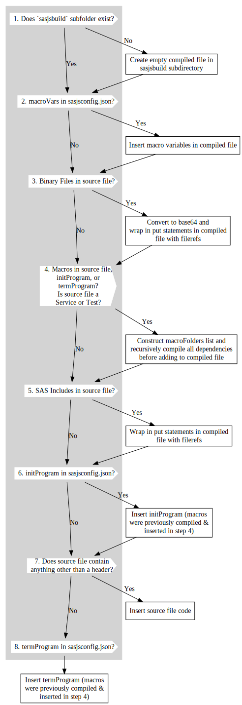

# sasjs compile

## Overview
Compilation in SASjs is driven from the `sasjs/sasjsconfig.json` file, and results in the creation of a single self-contained SAS program per JOB / SERVICE / TEST.

The benefits of working with compiled files are severalfold:

* Build on ONE platform, deploy to THREE (Viya, EBI, Base)
* Elimination of SAS Catalogs for macros / programs
* Elimination of filesystem dependency for code
* Resilient and Highly Portable Applications
* Consistent Performance
* Easy to debug & test

`sasjs compile` can be applied to a single file, or more commonly, to all the files in a project.

Content is added to each compiled Job/Service/Test in the following order:

1. MacroVars
2. Binary Files
3. Macros
4. Programs
5. initProgram
6. Job/Service/Test
7. termProgram

The following diagram illustrates the compilation of a [Service](/artefacts/#service) (service_xyz.sas) that includes some macro variables, as well as common macro dependencies across the `initProgram` and `termProgram`:


Notice that only one copy of the macro is inserted, even though it is defined in multiple artefacts.

The following diagram illustrates the logic flow when compiling a [Primary Artefact](/artefacts/#primary-artefact):



### 1. sasjsbuild Folder

In every SASjs project, content is split according to whether the [file type](/artefacts/) is Job, Service or Test.  For a project that has all three, and has tests covering SAS Macros / Jobs / Tests, the `sasjsbuild` folder (and ultimately, the remote SAS folder) will contain the following tree:

* `jobs/`
* `services/`
* `tests/jobs/`
* `tests/macros/`
* `tests/services/`

Below the above, the immediate child will be the last child of the `xxxFolder` - eg for a `serviceConfig` as follows:

```json
{
  "serviceConfig":{
    "serviceFolders":[
      "/some/project/location"
    ]
  }
}
```

A filepath of `/some/project/location/myservice.sas` will thus be compiled inside: `services/location/myservice.sas`.

Nested directories are supported.  For a filepath of `/some/project/location/subfolder/subsubfolder/here.sas` the compile location would be: `services/location/subfolder/subsubfolder/here.sas`.

### 2. Macro Variables

Macro variables are inserted according to the type of the compiled file, ie from one of the following objects:

* `jobConfig`
* `serviceConfig`
* `testConfig`

### 3. Binary Files

Binary Files are converted to a base64 string and wrapped in put statements with a user provided fileref as described [here](/artefacts/#binary-files)

### 4. SAS Macros

SAS Macros are recursively compiled to ensure there is only one copy of each macro across the initProgram, termProgram, the primary artefact itself, and the `webout()` macros (if a Service or Test).

More info [here](/artefacts/#sas-macros).

### 5. SAS Includes

SAS Includes are wrapped in put statements and a filename statement is generated with a user provided fileref.

More info [here](/artefacts/#sas-includes).

### 6. initProgram

The `initProgram` executes right before the main Job / Service / Test.

More info [here](/artefacts/#initprogram).

### 7. Source Code

This section contains the actual code inside the Job / Service / Test.

More info [here](/artefacts/#primary-sasjs-file-types).

## Compile Single File

When compiling a single file, it is necessary to state whether the file is being compiled is a job, service or test (as these file types are compiled with differing pre-code).

### Syntax

```
sasjs compile <action> [additional arguments]
```

`action` can be `job` or `service` or `test`

Additional arguments include:

- `--source` (alias `-s`) - the path/name.ext of the individual source file to compile (as job or service). MANDATORY
- `--target` (alias `-t`) - The target to use for obtaining the source folders of programs and macros. If it is not specified, the default target will be used, mentioned in `sasjsconfig.json`. The target can exist either in the local project configuration or in the global `.sasjsrc` file. OPTIONAL
- `--output` (alias `-o`) - path where output of the compiled job or service will be saved. OPTIONAL. If not provided, the output will go to the root of the `sasjsbuild` folder if in a project (`sasjsbuild` would be emptied first), else in the current working directory.

```bash
sasjs compile job -s sasjs/jobs/admin/somejob -o compiledjobs/folder
sasjs c service --source sasjs/services/common/appinit -t myTarget
```

## Compile Project

### Syntax

```
sasjs compile [additional arguments]
```

Additional arguments include:

- `--target` (alias `-t`) - The target to use for obtaining the source folders of programs and macros. If it is not specified, default target will be used, mentioned in `sasjsconfig.json`. The target can exist either in the local project configuration or in the global `.sasjsrc` file. OPTIONAL

Examples:

```bash
sasjs compile
sasjs c
sasjs c -t someTarget
```
### Artefact Compilation
From the root of the project, run: `sasjs compile`. This will cycle through all the Jobs / Services / Tests in the `jobFolders` / `serviceFolders` / `testFolders` arrays in the `sasjsconfig.json` file, extract all of the dependent Binary Files, SAS Macros, SAS Includes, and create one self-contained file per Job (or Service, or Test) inside the `sasjsbuild` folder. The self-contained file will also include any `initProgram`, `termProgram` and `macroVars` defined in the relevant config objects.

The `binaryFolders`, `macroFolders` and `programFolders` arrays are searched for Binary Files, SAS Macros and SAS Includes (first in the target config, then in the root).

The `serviceConfig`, `jobConfig` and `testConfig` objects may have attributes split at either or both target and root level in the `sasjsconfig.json` file.

### Tests compilation

As part of compilation process test files will be compiled as well. Test configuration should be provided in `sasjs/sasjsconfig.json`. Test files should be placed in the same folders with services, jobs and macros. Compiled test files will result in `sasjsbuild/tests` folder under `services`,`jobs` or `macros` subfolder respectively. Tests execution flow will be described in `sasjsbuild/testFlow.json` file.

The `testConfig` object allows two additional programs to be compiled (as tests):

* `testSetUp` - executed once at the beginning of the test run
* `testTearDown` - executed once, at the end of the test run

### SyncFolder Compilation

If the `syncFolder` attribute is set, then the contents of that folder will be simply copied into the `sasjsbuild` folder.  This is useful for providing mocked services (eg in [sasjs/server](https://github.com/sasjs/server)) or to add arbitrary content to the SAS logical folder tree.

### Streaming Apps
If `streamWeb` is `true`, then the `index.html` file in your `webSourcePath` is also scanned and any linked JS / CSS files are also compiled into the `streamWebFolder` folder. The `index.html` becomes a `clickme` service in your `appLoc` SAS folder root.


### Base64 encoding

If you don't have an `index.html` and you just want to compile arbitrary binary content (such as images, mp3, excel files etc) as base64 services, set the location of the content in `assetPaths`. All files in the specified folder(s) will be turned into web services.
