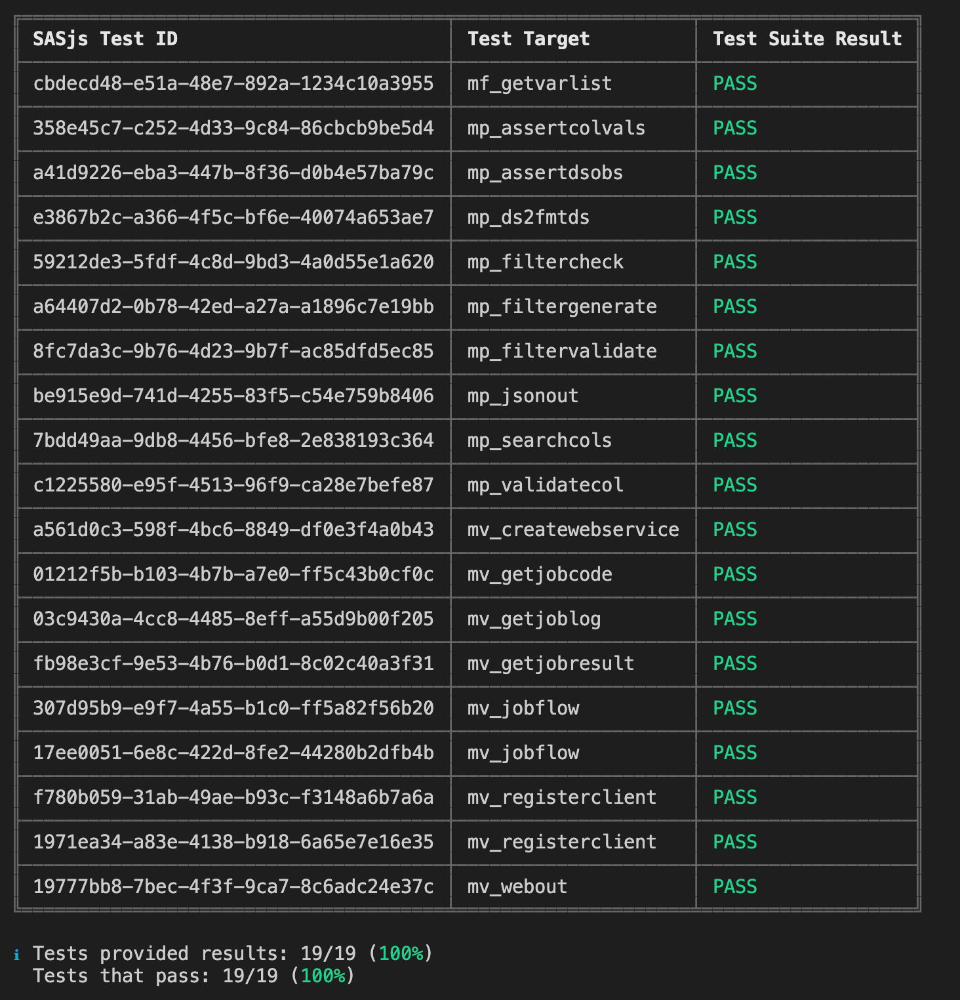
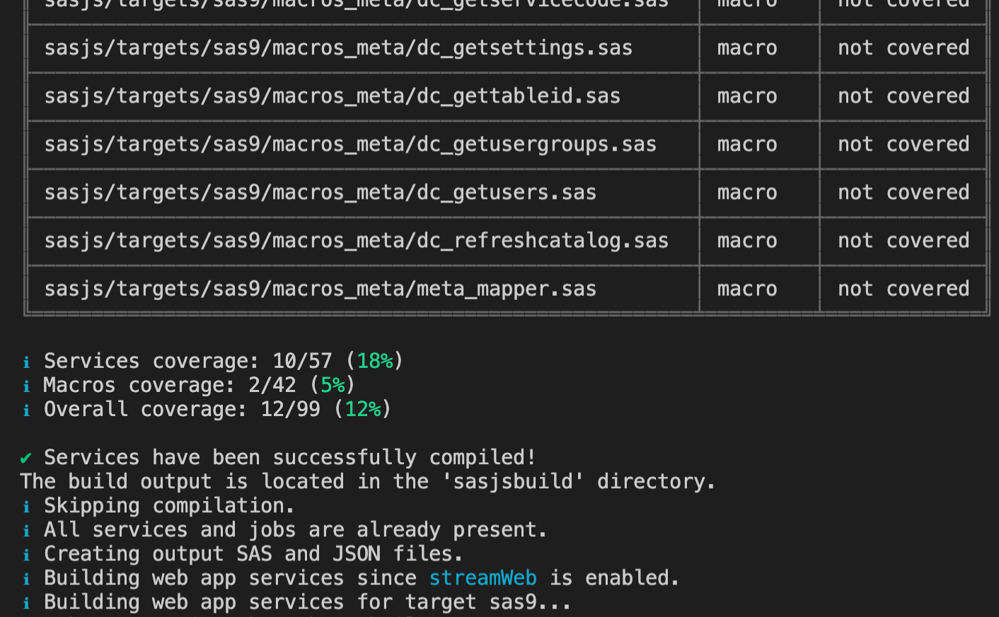
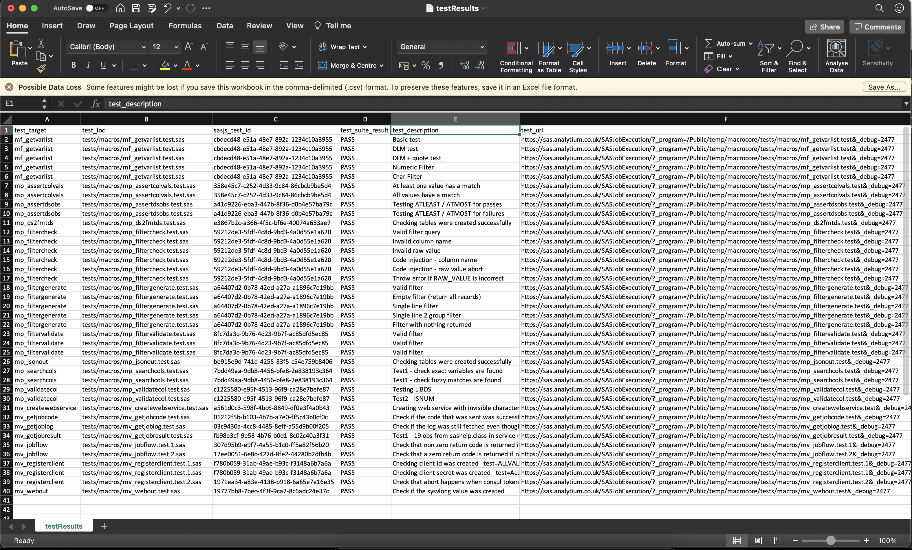
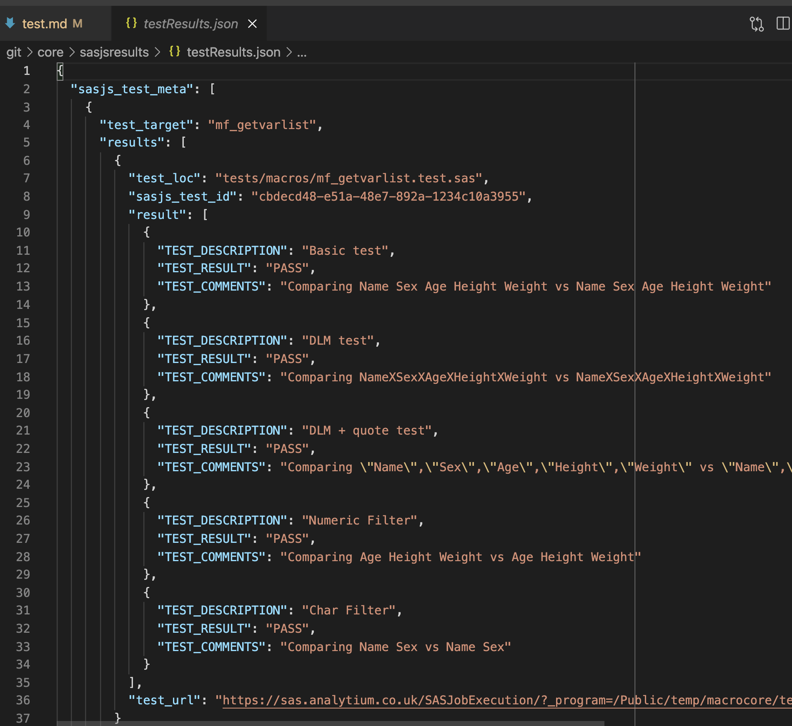
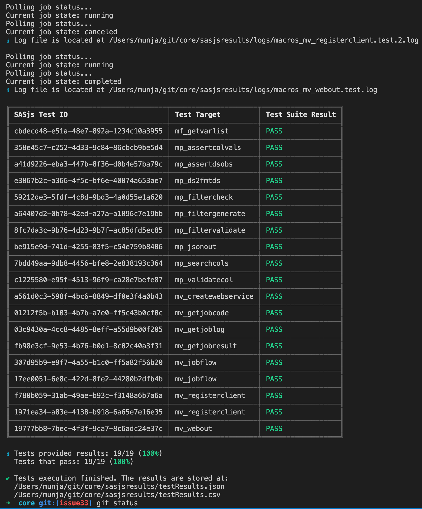

# sasjs test

The `sasjs test` command triggers deployed SAS unit tests for execution, and collects the test results in both JSON and CSV format.

The results are also displayed in the console, as follows:



Tests are compiled & deployed as _services_ (STPs in SAS 9 or Jobs in Viya).  In this way, every test is completely isolated with it's own SAS session.

To create a test, simply create a file with the same name as the Job / Service / Macro being tested, but with a `.test.sas` extension.  If you have multiple tests, you can add a `.test.[integer].sas` extension, and the tests will proceed according to the integers provided.

You can send back one or more test results in a single program by creating a table called `work.test_results` with the following entries:

|TEST_DESCRIPTION:$256|TEST_RESULT:$4|TEST_COMMENTS:$256|
|---|---|---|
|Some description|PASS|Some run related comment|
|Another test description|FAIL|some explanation of the failure|

The results should be sent back using the following macros (which could be in your `termProgram` entry):

```sas
%webout(OPEN)
%webout(OBJ, TEST_RESULTS)
%webout(CLOSE)
```

Examples of tests for SAS Macros are available in the [SASjs/CORE library](https://github.com/sasjs/core/tree/main/tests).

Further macros that can help with assertions are:

* [mp_assert](https://core.sasjs.io/mp__assert_8sas.html) - generic assertion
* [mp_assertcols](https://core.sasjs.io/mp__assertcols_8sas.html) - Asserts the existence (or not) of certain columns
* [mp_assertcolvals](https://core.sasjs.io/mp__assertcolvals_8sas.html) - Asserts the existence (or not) of particular column values
* [mp_assertdsobs](https://core.sasjs.io/mp__assertdsobs_8sas.html) - Asserts the existence (or not) of dataset observations

## Syntax

```
sasjs test <filteringString> --source <testFlowPath> --outDirectory <folderPath> -t <targetName>
```

- Providing `filteringString` is optional. If not present, *all* tests mentioned in test flow file will be executed.
- Providing `source` flag is optional. If not present, CLI will use test flow located at `sasjsbuild/testFlow.json` (created when running `sasjs build`).
- Providing `outDirectory` flag is optional. If not present, CLI will save outputs into the temporary `sasjsresults` folder.

## Examples

Execute all tests for the default target:

```bash
sasjs test
```

Execute all tests in the macros folder:

```sh
sasjs test /macros/
```

Execute all tests starting with "mv_" and save the output in 'myresults' folder

```sh
sasjs test mv_ --outDirectory /somedir/myresults
```

## Configuration

Test configuration can be provided at root or target level. Configuration example:

```
testConfig: {
  "initProgram": "sasjs/tests/testinit.sas",
  "termProgram": "sasjs/tests/testterm.sas",
  "macroVars": {
    "testVar": "testValue"
  },
  "testSetUp": "sasjs/tests/testsetup.sas",
  "testTearDown": "sasjs/tests/testteardown.sas"
}
```

- `testSetUp` will be executed prior to all tests
- `testTearDown` will be executed after all tests have finished
- `initProgram` is inserted at the start of every test
- `termProgram` is inserted at the end of every test
- `macroVars` are defined at the start of every test

## File Name Convention

Only files names that match following pattern will be considered as tests. Pattern:

```
[filename].test<.integer>.sas
```

Examples:

```
some_service.test.sas
some_job.test.0.sas
some_job.test.1.sas
```

- Providing a test integer is optional, if provided, the tests will be executed accordingly to numerical order - eg `some_job.test.0.sas` first and `some_job.test.1.sas` second.

## Coverage

A SAS Service, Job or Macro is considered covered if there is a test file with the same **filename**, for example:

```
├── some_service.sas
├── some_service.test.sas
├── some_job.sas
└── some_macro.test.sas
```

In the example above, `some_service` will be considered covered, `some_job` will be considered **not** covered and `some_macro.test` will be considered as a standalone test.

Overall coverage is displayed, along with a group summary for Jobs, Services and Macros.



!!! note
    We are planning a more 'intelligent' coverage system that can detect whether a macro / servivce / job was executed as part of the test suite.  If this would be helpful to your project, do [get in touch](https://sasapps.io/contact-us)!


## Test body

Test example that provides a result:

```sas
data work.test_results;
  test_description="some description";
  test_result="PASS";
  test_comments="We did this & that happened";
  output;
run;
%webout(OPEN)
%webout(OBJ, test_results)
%webout(CLOSE)
```

Providing the `test_results` table with a `test_result` variable is required, in order for the frontend to determine if the test is a `PASS` or `FAIL`.  The `webout()` macro definition will be deployed as precode in the compiled test, and is essentially a wrapper for [mm_webout.sas](https://core.sasjs.io/mm__webout_8sas.html) or [mv_webout.sas](https://core.sasjs.io/mv__webout_8sas.html) according the [serverType](https://cli.sasjs.io/sasjsconfig.html#targets_items_anyOf_i0_serverType) of the [target](https://cli.sasjs.io/faq/#what-is-the-difference-between-local-and-global-targets).

## Tests flow

SAS unit tests will be executed one after another. Execution order is described in `sasjsbuild/testFlow.json` which is created as part of compilation process (`sasjs compile`).

## Tests results

By default test results will be saved in the `sasjsresults` folder. An example of `sasjsresults` folder structure:

```
├── logs
│  ├── macros_some_macro.test.1.log
│  ├── macros_some_macro.test.log
│  ├── services_some_service.test.log
│  ├── jobs_some_job.test.log
│  ├── testteardown.log
│  └── testsetup.log
├── testResults.csv
└── testResults.json
```

## Running SAS Tests with SASjs

In order to run tests, take the following steps:

1. Provide tests configuration (testConfig) in the `sasjs/sasjsconfig.json` file
2. Create test files in services, jobs or macro folders (with .test.sas extension).
3. Execute `sasjs cbd -t <targetName>` to compile and deploy the tests as isolated SAS web services
4. Execute `sasjs test -t <targetName>`
5. Visit the local `sasjsresults` folder to review results.

To assist with debugging, all logs are captured, and we generate a URL so that you can easily click and re-run any particular individual test.

CSV Format:



JSON Format:


Console Output:



